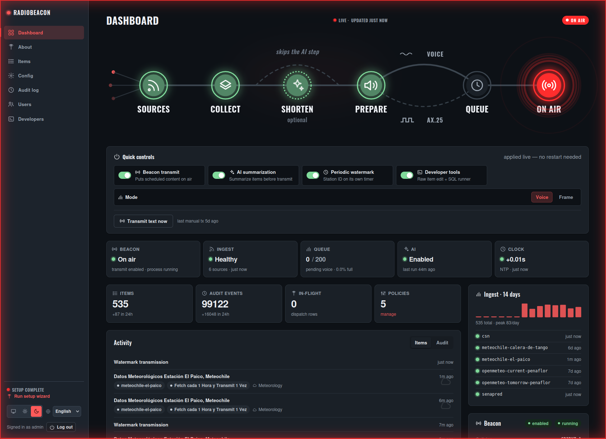
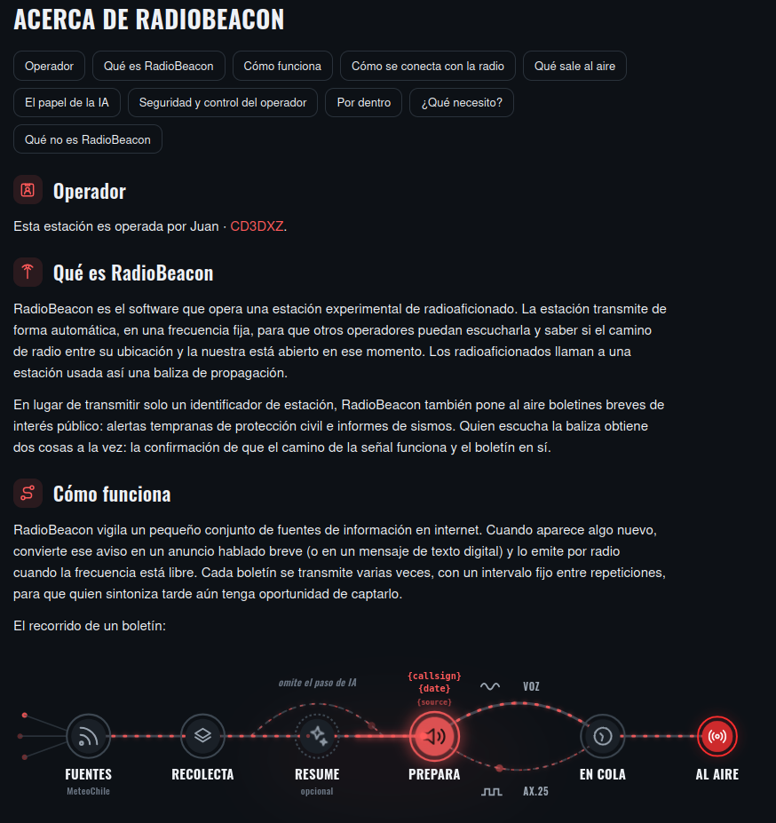

# radiobeacon

[](CHANGELOG.md)
[](https://github.com/juantoledo/radiobeacon/releases)
[](https://www.python.org/)
[](LICENSE)

*Versión en español: [README.es.md](README.es.md).*

**RadioBeacon** is the software behind an experimental amateur-radio
station: it transmits automatically, on a fixed frequency. Radio amateurs
call a station used this way a *propagation beacon*.

Instead of transmitting only a station identifier, RadioBeacon also puts
short public-interest bulletins on the air — civil-protection early
warnings and earthquake reports. Someone who hears the beacon gets two
things at once: confirmation that the signal path works, and the bulletin
itself.

<p align="center">
  
  
</p>

---

**Contents:** [How it works](#how-it-works) ·
[How it connects with the radio](#how-it-connects-with-the-radio) ·
[What goes on air](#what-goes-on-air) · [The role of AI](#the-role-of-ai) ·
[Safety and operator control](#safety-and-operator-control) ·
[Under the hood](#under-the-hood) · [What do I need?](#what-do-i-need) ·
[What RadioBeacon is not](#what-radiobeacon-is-not) ·
[Quick start](#quick-start) · [Learn more](#learn-more)

## How it works

RadioBeacon watches a small number of information sources on the
internet. When something new appears, it turns that notice into a short
spoken announcement (or a digital text message) and plays it over the
radio when the frequency is clear. Each bulletin is transmitted a few
times, a set interval apart, so a listener who tunes in late still has a
chance to catch it.

The journey of a single bulletin:

1. **Watch for updates** — RadioBeacon checks each information source on
   its own schedule.
2. **Collect** — Every new notice is saved, with its original wording kept
   intact.
3. **Shorten (optional)** — A long notice is condensed into two or three
   clear sentences. This step uses AI, stays off unless the operator turns
   it on, and is skipped for notices that are already short.
4. **Prepare the message** — The text becomes spoken Spanish audio, or a
   digital packet. The station callsign and a note that this is an
   unofficial relay are added automatically.
5. **Wait for a clear frequency** — Nothing is transmitted while another
   station is using the channel.
6. **On air** — The bulletin is broadcast, and repeated a few times a set
   interval apart.

```
sources  →  stored item  →  (optional) AI summary, 2–3 sentences  →  sized for the chosen mode
                                                                      │
                                                          queued: N transmissions,
                                                          M seconds apart
                                                                      │
                                                      rendered to a WAV, one at a time
                                                                      │
                                            handed to SvxLink → played when the channel is idle
```

Every one of these steps is recorded in the operator dashboard, so the
operator can see exactly what was received and what went on the air.

## How it connects with the radio

RadioBeacon does not control the transmitter directly. It prepares a
ready-to-play audio file and hands it to the station's transmitter-control
software — [SvxLink](https://www.svxlink.org/) — which keys the radio and
plays the clip only when the channel is idle.

RadioBeacon is transmit-only. It never listens to, decodes, or records
other stations — it has no receiver of any kind.

## What goes on air

Content comes from sources the operator chooses. Two are set up out of the
box:

- **SENAPRED early warnings** — Chile's civil-protection alerts for
  weather, hydrological and geophysical events.
- **CSN earthquake reports** — seismic events published by the Centro
  Sismológico Nacional.

The operator can add more sources — any public web feed — by describing it
in the dashboard. No programming is involved.

RadioBeacon is an experimental, unofficial relay. Every alert it transmits
says so, and points listeners to SENAPRED as the official source. It is
not an emergency broadcast service and must not be relied on as one.

## The role of AI

Artificial intelligence has one narrow job in RadioBeacon: shortening a
long notice into a few complete sentences. It works from a fixed
instruction that tells it to invent nothing and to leave no sentence
unfinished. It's provider-agnostic — OpenAI, Claude, or a self-hosted
Ollama model, chosen by config — and with Ollama it stays fully local.

AI never decides what is transmitted, never changes the station's
settings or identity, and is off by default. Notices that are already
short enough are never sent to it.

If the AI step fails, the operator chooses in advance what happens: use
the original text, use just the headline, or transmit nothing.

## Safety and operator control

- **Silent by default.** A fresh install transmits nothing. The operator
  has to switch transmission on and fill in the station identity —
  callsign, location, frequency — before anything goes on the air.
- **One kind of message at a time.** The station sends either voice or
  digital packet, never both at once.
- **A clear frequency comes first.** Transmissions wait for the channel to
  be idle.
- **Nothing piles up.** A bulletin that has been waiting too long expires
  instead of flooding the air later.
- **Full record.** Every fetch, every shortening and every transmission is
  logged in the dashboard, and any voice clip can be played back in the
  browser.

## Under the hood

The information sources are public services run by government agencies.
RadioBeacon reads them through the same web interfaces the agencies' own
websites use — no special access or agreement is involved. Each source is
polled on its own independent timer, so a fast-moving feed and a slow one
don't hold each other up.

An unfolding emergency usually appears as a series of updates rather than
one edited notice. RadioBeacon treats each update as its own bulletin and
never rewrites or merges them. Anything it has already seen is ignored, so
the same report is not aired twice.

RadioBeacon never keys the radio itself. That is the job of SvxLink, the
established software that controls the station's transmitter and shares
the frequency courteously with other operators. RadioBeacon builds a
finished audio clip and places it in a queue; SvxLink plays clips one at a
time, and only after the frequency has been silent for a few seconds. A
clip that has waited too long is dropped rather than sent late.

In digital mode a bulletin goes out as a short data packet instead of
speech. RadioBeacon uses Direwolf, a widely used amateur-radio packet
program, to turn the text into the tones a packet receiver decodes. These
packets run on an experimental frequency and never touch the public APRS
network.

Aside from fetching source updates — and the optional shortening step —
everything runs on the operator's own machine with no internet connection:
the speech, the packet tones, the queue, and the dashboard.

## What do I need?

RadioBeacon only prepares the audio (or packet) — turning it into an
actual radio signal takes a few pieces of hardware and software that
live outside this repository:

- **A computer** to run RadioBeacon and its components. Even modest,
  low-power hardware is enough — e.g. a Raspberry Pi or a
  [ZimaBoard](mq/README.md).
- **[SvxLink](https://www.svxlink.org/)**, installed and configured —
  the software that actually keys the radio. RadioBeacon only hands it
  a finished audio file; see
  [documentation/svxlink-txqueue-SETUP.md](documentation/svxlink-txqueue-SETUP.md).
- **An amateur-radio license** authorizing transmission on the chosen
  frequency; RadioBeacon is meant to be run by a licensed operator.
- **An internet connection** so RadioBeacon can fetch updates from its
  information sources — everything else it does runs on the local
  machine.

### The radio interface

Between the computer and the radio sits an interface device — SvxLink
talks to it, not to the radio directly. It does two jobs: it feeds the
computer's audio output into the radio's microphone input so the
prepared clip can be transmitted, and it carries the PTT (push-to-talk)
signal that keys the radio for exactly as long as the clip plays, then
releases it. Depending on the model, that PTT line rides on a USB sound
chip's GPIO pins, a serial port's RTS/DTR lines, or a CAT command —
SvxLink supports all of these.

A combined USB sound-card-and-PTT interface built for this purpose —
something like the **R1 2023** — is the simplest option: one USB cable
to the computer, one audio-and-PTT cable to the radio's accessory port,
with no separate sound card or serial adapter to wire up and configure
by hand.

### The radio itself

Any transmitter that can be keyed by an external PTT signal and held
keyed for the length of a transmission works — RadioBeacon and SvxLink
don't need anything more advanced than that. Commercial land-mobile
transceivers are a common choice for a build like this because they're
rugged, inexpensive secondhand, and designed for exactly this kind of
unattended duty cycle; a **Motorola PRO 5100** (or a similar model) is a
reasonable example.

Whatever radio is used, it has to be:

- **programmed** — with the manufacturer's programming software and
  cable — to transmit on the beacon's chosen amateur frequency,
- **connected to an antenna and feedline** suited to that band, and
- **able to key up repeatedly**, back to back, for as many repeats as
  the transmission schedule calls for.

## What RadioBeacon is not

- Not an official emergency channel, and not a substitute for SENAPRED,
  ONEMI, or any government alerting system.
- Not a two-way or dispatch system — it cannot receive messages or
  acknowledge them.
- Not a commercial product. It is a single experimental station, run by a
  licensed amateur-radio operator and shared as open source.

---

## Quick start

```bash
./start.sh   # fresh clone: creates .env, sets up one shared venv, and
             # starts data collection + delivery + actions + the
             # dashboard + the beacon together (Ctrl+C stops all). No
             # secrets required; the beacon starts disabled
             # (BEACON_ENABLED=false).
```

Once running, open `http://127.0.0.1:8080` — the operator dashboard.

Setting up the radio hardware next? See
[documentation/svxlink-txqueue-SETUP.md](documentation/svxlink-txqueue-SETUP.md)
for installing and configuring SvxLink and Direwolf from a fresh Debian/Ubuntu
box, apt install through on-air — or run
[`documentation/svxlink-txqueue-install.sh`](documentation/svxlink-txqueue-install.sh)
to automate it.

## Learn more

- [documentation/ARCHITECTURE.md](documentation/ARCHITECTURE.md) — how the
  seven components fit together, Policies, and running each piece
  standalone.
- [documentation/CONFIGURATION.md](documentation/CONFIGURATION.md) — the
  `.env` reference, station identity, logging, and config import/export.
- [documentation/svxlink-txqueue-SETUP.md](documentation/svxlink-txqueue-SETUP.md)
  — setting up the radio-side hand-off to SvxLink.
- Each component has its own README:
  [data-adapters/](data-adapters/README.md),
  [dispatcher/](dispatcher/README.md), [mq/](mq/README.md),
  [actions/](actions/README.md), [ui/](ui/README.md),
  [beacon/](beacon/README.md), [storage/](storage/README.md).
